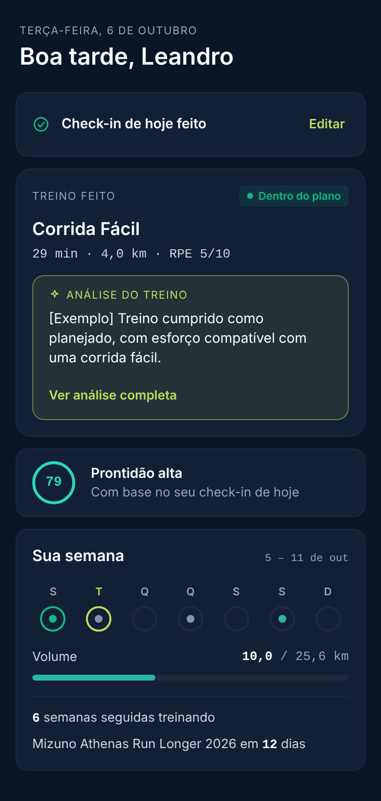
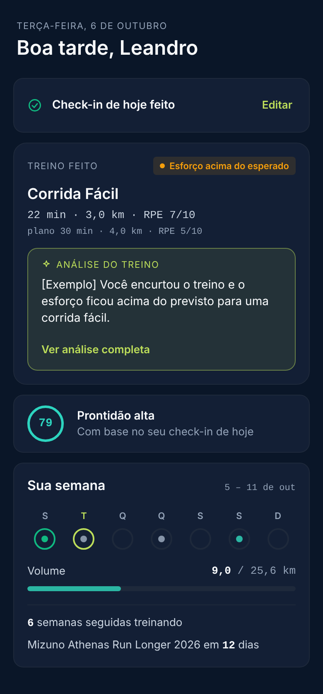

**Tamanho:** S · **Trilha:** Full

# add-athlete-workout-verdict-chip

> Full porque toca dois repos (`menthoros-backend`, `menthoros-front`) e adiciona um campo ao
> contrato do endpoint de análise do atleta. Sem mudança de schema e sem chamada de LLM.
> Depende de `refine-athlete-workout-analysis-card` (mesmos componentes de front).

## Referência visual

Capturas do board do founder (390 px), em `ui/`. Os textos "[Exemplo]" são placeholders.

| Dentro do plano | Esforço acima do esperado |
|---|---|
|  |  |

Os `.html` de mesmo nome trazem a marcação exata (estilos inline com os valores finais).
Canvas original: <https://claude.ai/artifact/52uq835bTThybo2x4xUSjY> (privado do founder).

## Por que

Depois de registrar o treino, o atleta só descobre se cumpriu o plano lendo a análise da IA, que
leva ~1 min para ficar pronta e pode não aparecer (treino não elegível, falha, bloco reprovado).
A resposta à pergunta mais básica — "fiz o que estava planejado?" — é determinística e já pode ser
dada no instante do registro, a partir dos números que o backend tem.

## O que muda

1. **Veredito calculado no backend, sem LLM.** `AthleteWorkoutAnalysisOutputDto` ganha o campo
   `veredito`, calculado de executado vs. planejado:
   `DENTRO_DO_PLANO`, `ABAIXO_DO_PLANO`, `ACIMA_DO_PLANO`, `ESFORCO_ACIMA_DO_ESPERADO`.
   Presente em `PENDING` e `COMPLETED`; ausente quando o realizado não tem planejado vinculado.
2. **Chip no card do treino.** O front pinta um chip com ponto + rótulo:
   - Home: no cabeçalho do `TodayCompletedCard`, à direita de "TREINO FEITO" (como no board).
   - `WorkoutDetailDrawer` e `PostWorkoutFeedbackCard`: no cabeçalho do `WorkoutAnalysisCard`.
3. **Cores por estado, nunca lime.** `DENTRO_DO_PLANO` usa `semantic-success`; os outros três usam
   `semantic-warning`. Fundo no mesmo tom a 12% de opacidade, raio `radius-xs`, texto 11 px/600.
4. **Rótulos:** "Dentro do plano", "Abaixo do plano", "Acima do plano", "Esforço acima do esperado".

## Fora de escopo

- Chip para treinos em que o endpoint de análise devolve `204` (não elegível, kill switch
  desligado, análise falhou) — ver Open Questions.
- Veredito na visão do coach, no plano semanal ou no `WeekAgendaRow`.
- Mudar a regra da linha "plano …" do card (continua a comparação de valores formatados).
- Análise sob demanda e gatilho em destaque para desvio (descartados pelo founder em 2026-10-06).
- Qualquer uso do veredito como entrada do prompt da IA.

## Critérios de aceite

1. Given planejado 30 min / 4,0 km / RPE 5 e executado 29 min / 4,0 km / RPE 5, When o atleta
   consulta a análise, Then `veredito = DENTRO_DO_PLANO`.
2. Given planejado RPE 5 e executado RPE 7, Then `veredito = ESFORCO_ACIMA_DO_ESPERADO`, mesmo que
   duração e distância também estejam abaixo do plano.
3. Given executado com duração ou distância abaixo de 85% do planejado e RPE dentro do esperado,
   Then `ABAIXO_DO_PLANO`; acima de 115%, Then `ACIMA_DO_PLANO`.
4. Given realizado sem planejado vinculado, Then o campo `veredito` não aparece no JSON e nenhum
   chip é renderizado.
5. Given um campo ausente dos dois lados (sem distância, sem RPE esperado), Then ele é ignorado na
   comparação e o veredito sai dos campos restantes.
6. Given análise `PENDING`, Then o `veredito` já vem preenchido e o chip aparece antes do texto da IA.
7. Given `veredito` presente, When a Home renderiza o estado `FEITO`, Then o chip aparece na mesma
   linha de "Treino feito", com `data-testid="workout-verdict-chip"` e o rótulo em PT-BR.
8. O chip comunica o estado por texto e ponto, não só por cor; o texto tem contraste ≥ 4.5:1 sobre
   o fundo do chip.
9. O front não recalcula limiares: o rótulo e a cor derivam só do enum recebido.
10. `./mvnw clean verify` e `npm run lint && npm run build && npm run test:run` passam; a E2E
    `tests/e2e/athlete/workout-analysis.spec.ts` cobre a presença do chip.

## Métrica de sucesso

- **Atleta:** o veredito fica visível no primeiro carregamento da Home após o registro, sem esperar
  a análise (verificável na E2E: chip presente com análise `pending`).
- **Rotina do treinador:** o `veredito` passa a existir como dado calculado e testado no backend;
  a métrica de acompanhamento é a distribuição de vereditos por assessoria
  (`atleta_treino_veredito_total{veredito}`), que mostra ao founder quanto dos treinos sai do plano
  antes de decidir levar o mesmo sinal para a tela do coach.

## Open Questions & Assumptions

- **Decidido (founder, 2026-10-06):** chip conforme o board.
- **Decidido (2026-10-06, gate DoR do `/implement init`):** limiares ±15% para duração/distância e
  RPE ≥ esperado + 2 para "esforço acima" aceitos como padrão operacional, configuráveis
  (`app.workout-analysis.verdict.*`) e recalibráveis via a métrica de distribuição por assessoria.
- **Decidido (2026-10-06, gate DoR):** precedência é esforço → desvio misto (ambas as dimensões
  comparáveis, uma acima e outra abaixo) tratado como acima → abaixo → acima → dentro; um único
  veredito por treino. Ver `design.md` D2 para o detalhe do desvio misto, achado pelo Codex
  adversarial review e corrigido antes da implementação.
- **Decidido (2026-10-06, gate DoR):** dado planejado sem contrapartida executada (ex.: distância
  prescrita, não registrada) não vira `DENTRO_DO_PLANO` por falta de evidência — vira `null` quando
  nenhuma outra dimensão aponta desvio. Achado Codex corrigido em `design.md` D2.
- **Assumido:** o veredito viaja no DTO da análise. Consequência: sem resposta `200` da análise não
  há chip (inclui a transição `PENDING` → `FAILED`, achado Codex, aceito nesta versão — ver
  `design.md` Riscos). Alternativa, se o founder quiser o chip em 100% dos treinos com planejado:
  expor o campo também em `realizadoHoje` do `GET /me/home` — fica como extensão.
- **Aberto:** RPE abaixo do esperado (treino "fácil demais") hoje cai em `DENTRO_DO_PLANO`.
- **Aberto:** o atleta vê um julgamento ("abaixo do plano") sem passar pelo coach. É determinístico,
  não é saída de IA, mas o tom dos rótulos merece o olhar do `product-reviewer`.
- **Processo concluído (2026-10-06):** `spec-reviewer` e `/codex:adversarial-review` executados no
  gate DoR do `/implement init`; achados incorporados em `design.md`. `product-reviewer` dedicado
  ainda não rodou — avaliar no `/qa` ao final da implementação, já que o tom dos rótulos continua
  um ponto aberto acima.
