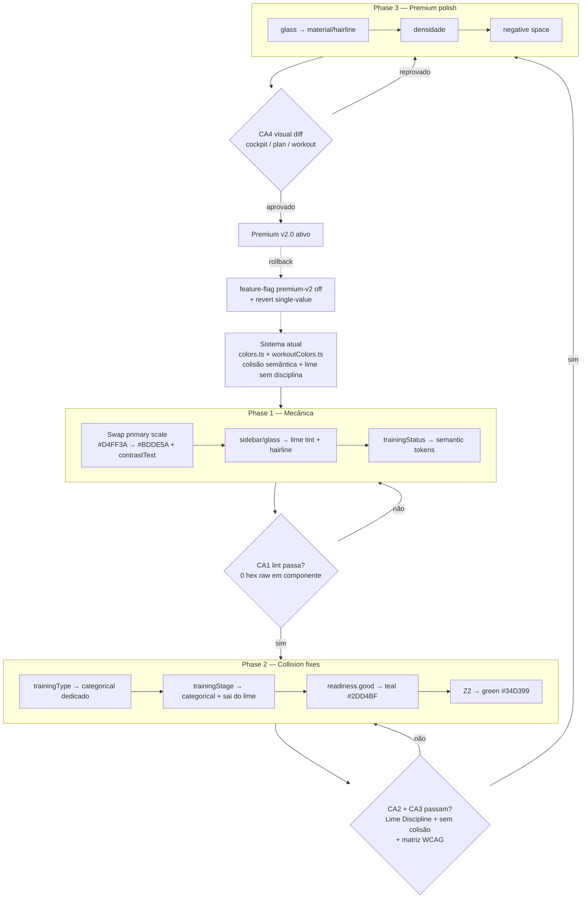

# Design — refactor-color-system-premium-v2

## ADR: migração do sistema de cores para Premium v2.0

### Context

O frontend (`menthoros-front`) usa **MUI dark mode** com cor 100% via tokens TypeScript — sem Tailwind, sem CSS custom properties para cor. As primitivas vivem em `src/shared/design-tokens/colors.ts`; a derivação MUI em `src/theme/tokens.ts`; as taxonomias de domínio em `src/shared/theme/workoutColors.ts`.

O sistema atual carrega dois débitos estruturais (evidência no código real):

- **Colisão semântica.** Categorias de domínio apontam para tokens semânticos:
  - `WORKOUT_TYPE_COLORS.TEMPO = semantic.warning[500]`, `INTERVALADO = semantic.danger[500]`, `REGENERATIVO = semantic.success[500]`, `CONTINUO = semantic.warning[400]`.
  - `WORKOUT_STAGE_COLORS.aquecimento = warning[500]`, `esforco = danger[500]`, `recuperacao = success[500]`, `desaquecimento = info[500]`, `principal = primary[500]`.
  - `readiness.high = primary[500]` (lime), `readiness.medium = warning[500]`, `readiness.low = danger[500]`.
  Categoria e estado falam a mesma língua de cor → o treinador não os distingue.
- **Lime sem disciplina.** `#D4FF3A` (lime de marca) vaza para etapa `principal` e banda `readiness.high`. Lime ubíquo = lime sem significado.

A paleta **Premium v2.0** (`theme.premium.ts`) foi desenhada para resolver os dois.

### Decision

Adotar `theme.premium.ts` como **single source of truth** das primitivas de cor e migrar em **três fases isoladas** (mecânica → collision fixes → polish), cada fase com revert single-value e protegida por feature-flag de tema (`premium-v2`).

Princípios da decisão:

1. **Estados ancoram em semantic; categorias ancoram em categorical dedicado.** Nenhuma categoria compartilha hex com `{danger, warning, success, info}` — exceto `injuryResponse`, que é intencionalmente o vermelho de perigo (lesão = sinal de alerta, não categoria neutra).
2. **Lime é marca/ação, e nada mais.** A escala `primary` (lime, suavizado para `#BDDE5A`) só aparece em brand e primary-action (incluindo o lime tint de seleção da sidebar). Removido de `stage.principal` (→ teal) e `readiness` (→ green/teal).
3. **Heat ramp das zonas é preservado.** Z1→Z5 mantém a convenção fisiológica (cinza → verde → azul → âmbar → vermelho). **Só Z2 muda** (lime → green `#34D399`) — ver "Constraints obrigatórias".

### Consequences

**Positivas:**
- Tipo, etapa, estado e zona tornam-se visualmente separáveis — leitura de plano mais rápida.
- Lime recupera valor de sinal (marca/ação).
- "Componente nunca referencia hex raw" passa de convenção para invariante auditável em CI.
- Rollback barato: cada role é um token isolado; revert é single-value; feature-flag desliga a v2.0 inteira.

**Negativas / custos:**
- Risco de regressão de contraste nos novos hues categóricos (mitigado por matriz WCAG na Phase 2).
- Esforço de varredura: todo hex raw remanescente em componente precisa virar referência a token antes do CA1 passar.
- A mudança de Z2 (lime → green) altera uma cor que treinadores já memorizaram — comunicar como intencional.

## Token remap table — atual → Premium v2.0

Hex "atual" extraído de `colors.ts` e `workoutColors.ts`; hex v2.0 de `theme.premium.ts`.

### Primary scale (marca)

| Role | Atual | v2.0 | Razão |
|------|-------|------|-------|
| primary.50  | `#F7FFE0` | `#F6FAE8` | suaviza tint, menos saturado sobre navy |
| primary.100 | `#EEFFCC` | `#EDF6D1` | idem |
| primary.200 | `#E1FF9E` | `#DFEFB0` | idem |
| primary.300 | `#D4FF6B` | `#D2E98F` | idem |
| primary.400 | `#CFFF4D` | `#C7E373` | idem |
| **primary.500** | `#D4FF3A` | `#BDDE5A` | **brand canônico**: lime suavizado, menos vibração, melhor contraste de texto |
| primary.600 | `#A8CC2E` | `#94B144` | escala recalibrada |
| primary.700 | `#7C9923` | `#748E32` | idem |
| primary.800 | `#506617` | `#536A20` | idem |
| primary.900 | `#2A3D0A` | `#2A3D0A` | inalterado (âncora escura) |
| primary.contrastText | — | `#0A1628` | novo: navy garante texto legível sobre superfície lime |

### Surface / text

| Role | Atual | v2.0 | Razão |
|------|-------|------|-------|
| surface.900 (canvas) | `#0A1628` | `#0A1628` | canvas base inalterado |
| surfaceShift.panel | `#0E1B30` (surface.850) | `#0E1B30` | elevação por shift de cor, renomeada |
| surfaceShift.card | `#131F35` (surface.800) | `#131F35` | idem |
| surfaceShift.raised | — | `#1A2940` | novo nível de elevação (raised) |
| text.primary | `#F8FAFC` (surface.50) | `#F8FAFC` | inalterado, agora token de texto nomeado |
| text.secondary | `#64748B` (surface.500) | `#94A3B8` | clareado para legibilidade de texto secundário |
| text.muted | — | `#64748B` | muted explícito (era surface.500) |
| text.onAccent | — | `#0A1628` | navy sobre lime/accents |

### Semantic (âncoras — inalteradas)

| Role | Atual | v2.0 | Razão |
|------|-------|------|-------|
| danger  | `#EF4444` | `#EF4444` | âncora estável |
| warning | `#F59E0B` | `#F59E0B` | âncora estável |
| success | `#10B981` | `#10B981` | âncora estável |
| info    | `#3B82F6` | `#3B82F6` | âncora estável; **nunca em brand/hero** |

### readiness (collision fix + lime discipline)

| Banda | Atual | v2.0 | Razão |
|-------|-------|------|-------|
| critical | `danger[500]` `#EF4444` | `#EF4444` | mantém vermelho de risco |
| caution  | `warning[500]` `#F59E0B` | `#F59E0B` | mantém âmbar |
| good     | `primary[500]` **lime** | `#2DD4BF` (teal) | **tira lime** da prontidão; teal distinto de optimal |
| optimal  | `success[500]` `#10B981` | `#10B981` | verde = ótimo |

> Backend é dono das bandas (qual valor cai em qual banda). A UI só pinta a banda já resolvida. Os nomes mudam de `low/medium/high/peak` → `critical/caution/good/optimal` (alinhados ao backend).

### trainingType (collision fix — sai de semantic, entra categorical dedicado)

| Tipo | Atual | v2.0 | Razão |
|------|-------|------|-------|
| FACIL        | `surface[400]` `#94A3B8` | `categorical.slate` `#8694A8` | neutro dedicado |
| LONGO        | `cat1` `#3B82F6` | `categorical.teal` `#2BB6A3` | sai do azul (= info) |
| TEMPO        | `warning[500]` `#F59E0B` | `categorical.coral` `#F2845C` | **descolide de warning** |
| INTERVALADO  | `danger[500]` `#EF4444` | `categorical.magenta` `#E364A6` | **descolide de danger**; clareado de `#E0529C` na task 2.8 (contraste texto <4.5:1 contra `elevation.raised`) |
| REGENERATIVO | `success[500]` `#10B981` | `categorical.sage` `#7FB894` | **descolide de success** |
| FARTLEK      | `cat4` `#A855F7` | `categorical.violet` `#B670F8` | hue mantido, agora nomeado; clareado de `#A855F7` na task 2.8 (mesmo motivo) |
| CONTINUO     | `warning[400]` `#FBBF24` | `categorical.gold` `#E8C547` | **descolide de warning** |

### trainingStage (collision fix + lime discipline)

| Etapa | Atual | v2.0 | Razão |
|-------|-------|------|-------|
| aquecimento    | `warning[500]` `#F59E0B` | `categorical.gold` `#E8C547` | sai de warning |
| principal      | `primary[500]` **lime** | `categorical.teal` `#2BB6A3` | **tira lime** da etapa |
| esforco        | `danger[500]` `#EF4444` | `categorical.coral` `#F2845C` | sai de danger |
| recuperacao    | `success[500]` `#10B981` | `categorical.sage` `#7FB894` | sai de success |
| desaquecimento | `info[500]` `#3B82F6` | `categorical.slate` `#8694A8` | sai de info |

### zone (heat ramp preservado; só Z2 muda)

| Zona | Label | Atual | v2.0 | Razão |
|------|-------|-------|------|-------|
| Z1 | Recuperação | cinza | `#C8CDD4` | heat ramp: frio/cinza |
| Z2 | Base | **lime** | `#34D399` (green) | **única mudança intencional**: lime → green |
| Z3 | Tempo | azul | `#3B82F6` | heat ramp inalterado |
| Z4 | Limiar | âmbar | `#F59E0B` | heat ramp inalterado |
| Z5 | VO₂ Máx | vermelho | `#EF4444` | heat ramp inalterado |

### trainingStatus (ancorado em semantic — sem colisão, pois status É estado)

| Status | Atual | v2.0 | Razão |
|--------|-------|------|-------|
| REALIZADO | `success[500]` | `semantic.success` `#10B981` | estado de sucesso |
| PENDENTE  | `surface[400]` | `text.secondary` `#94A3B8` | estado neutro |
| PERDIDO   | `danger[500]` | `semantic.danger` `#EF4444` | estado de falha |
| PARCIAL   | `warning[400]` | `semantic.warning` `#F59E0B` | estado de atenção |

> `trainingStatus` referencia semantic **intencionalmente**: status é estado, não categoria. A regra de não-colisão vale entre **categorias** (type/stage/readiness/zone) e semantic — não entre **estado** e semantic.

### sidebar / glass

| Role | v2.0 | Razão |
|------|------|-------|
| sidebar.selectedBg | `rgba(189,222,90,0.15)` | lime tint = ação/seleção (uso de lime permitido) |
| sidebar.hoverBg    | `rgba(255,255,255,0.08)` | hover neutro |
| sidebar.divider    | `rgba(255,255,255,0.12)` | hairline |
| glass.bg     | `rgba(255,255,255,0.08)` | material translúcido |
| glass.hover  | `rgba(255,255,255,0.12)` | material hover |
| glass.active | `rgba(255,255,255,0.15)` | material active (task 3.1 — affordance já em produção, fora da tabela original) |
| glass.border | `rgba(255,255,255,0.15)` | hairline border |
| glass.borderHover | `rgba(255,255,255,0.25)` | hairline border no hover (task 3.1 — idem) |
| glass.blur   | `blur(10px)` | desfoque de material |
| glass.shadow | `0 8px 32px rgba(0,0,0,0.40)` | profundidade |

## Diagrama de migração (3 fases)



## Hardcoded-hex inventory plan

Objetivo: provar e manter **0 literais de cor** em arquivos de componente.

1. **Inventário inicial (grep).** Levantar a baseline antes de migrar:
   ```bash
   # hex em componentes (exclui a camada de tokens, onde hex é legítimo)
   rg -n --pcre2 '#[0-9a-fA-F]{3,8}\b|rgba?\(|hsla?\(' src \
     --glob '!src/shared/design-tokens/**' \
     --glob '!src/theme/**' \
     --glob '!src/shared/theme/workoutColors.ts'
   ```
   Cada ocorrência vira item de task: substituir por referência a token v2.0.

2. **Regra ESLint que falha CI** (`no-raw-color-literals`). Implementada via `no-restricted-syntax` (ou regra custom local) sobre literais de string que casem cor, com **allowlist por path** (apenas `design-tokens/**`, `theme/**` e `workoutColors.ts` podem conter hex):
   ```js
   // eslint — aplicado a componentes (overrides excluindo a camada de tokens)
   'no-restricted-syntax': ['error', {
     selector: "Literal[value=/(#([0-9a-fA-F]{3}){1,2}\\b)|rgba?\\(|hsla?\\(/]",
     message: 'Cor raw proibida em componente. Use um token de src/shared/design-tokens.',
   }]
   ```
   `npm run lint` no CI falha se a regra disparar → **CA1**.

3. **Manutenção.** A regra roda em cada PR; a baseline grep cai a zero e fica zero. Sem `eslint-disable` para esta regra sem justificativa explícita.

## Lime Discipline check (auditável)

**Regra:** lime (qualquer hex da escala `primary.*`, faixa verde-amarela ~`#BDDE5A`/`#D4FF3A`) só pode aparecer em tokens de **brand** ou **primary-action**.

- **Allowlist:** `primary.*`, `sidebar.selectedBg` (lime tint de seleção = ação).
- **Proibido:** qualquer token de `readiness`, `trainingType`, `trainingStage`, `zone`, `trainingStatus`, `semantic`, `text`, `surface*` referenciar lime.

Verificação automatizável (unit test): percorre a árvore de tokens exportada e falha se um token fora da allowlist resolver para um hex na faixa lime:

```ts
const LIME_SET = new Set([primary[400], primary[500], primary[600]]); // faixa de marca
const ALLOWLIST = ['primary', 'sidebar.selectedBg'];
// para cada token role -> hex: se LIME_SET.has(hex) && !allowlisted(role) => fail
```

→ atende **CA2**.

## Constraints obrigatórias

Declaração explícita — estas restrições governam toda a implementação:

1. **Tokens TS + MUI dark.** Sem Tailwind, sem CSS color variables. Toda cor flui por tokens TypeScript consumidos pelo `createTheme` (MUI dark mode, instanciado uma única vez em `src/App.tsx`).
2. **Componentes nunca referenciam hex raw.** Um literal de cor (`#…`, `rgb()`, `rgba()`, `hsl()`) dentro de um arquivo de componente é **defect** — falha o lint (CA1). Hex só é legítimo na camada de tokens (`design-tokens/**`, `theme/**`, `workoutColors.ts`).
3. **Backend é dono dos thresholds.** As fronteiras de banda (TSB→Form, faixas de readiness) são resolvidas no backend. A UI **só renderiza o valor de banda já resolvido** — não recalcula nem decide threshold no cliente.
4. **Heat ramp Z1–Z5 preservado; só Z2 muda.** A rampa fisiológica (cinza → verde → azul → âmbar → vermelho) é convenção e permanece. **Apenas Z2 muda (lime → green `#34D399`)** — declarado aqui como **intencional**, para tirar lime da escala de zonas sem alterar a leitura térmica das demais.
5. **`info` blue (`#3B82F6`) jamais em brand surfaces / hero.** `info` é exclusivamente token semântico informativo; nunca aparece em superfície de marca, hero ou call-to-action.

## Non-goals

- Migrar para Tailwind ou CSS custom properties.
- Mudar o backend (thresholds, bandas).
- Re-tematizar o heat ramp das zonas além de Z2.
- Redesenho de layout/tipografia fora do polish de densidade/negative space da Phase 3.
