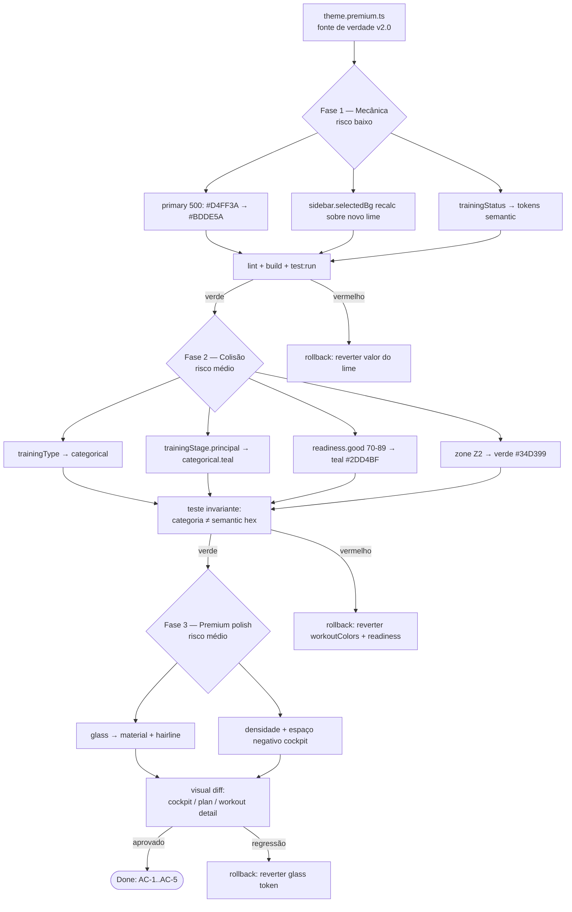

# Design — migrate-frontend-color-system-premium-v2

Narrativa em PT-BR; chaves, código e termos técnicos em inglês.

---

## A. OpenSpec-style change block (YAML)

```yaml
change:
  id: migrate-frontend-color-system-premium-v2
  title: Migração do sistema de cor do frontend para o token system Premium v2.0
  size: L
  track: Full
  repos: [menthoros-front]
  source_of_truth: theme.premium.ts        # congelado; não inventar cores
  motivation:
    - color_overload: >
        lime (#D4FF3A) hoje = marca + ação + readiness(70-89) + zone Z2 + stage
        "principal". Quatro significados numa cor. v2.0: lime = marca + ação only,
        retunado para #BDDE5A (tamed).
    - semantic_categorical_collision: >
        tipos de treino e etapas reaproveitam danger/warning/success/info, então um
        chip vermelho é ambíguo entre "erro" e "INTERVALADO". v2.0 move tipos/etapas
        para a paleta `categorical`; vermelho puro reservado a lesão (injuryResponse).
    - premium_drift: >
        lime neon + glass(blur) pesado leem energy-drink. Direção: restraint,
        hairlines, material sobre glow.
  scope:
    in:
      - src/shared/design-tokens/colors.ts      # primary, readiness, categorical
      - src/theme/tokens.ts                      # zones.Z2, glass, sidebar, readinessColor
      - src/shared/theme/workoutColors.ts        # type/stage/status remap (collision fix)
      - src/features/athlete/components/ReadinessCard.tsx  # consumir readinessColor()
      - src/shared/design-tokens/forbidden-uses.ts         # atualizar mapa p/ v2.0
      - eslint.config.js                          # regra no-raw-color-literals
      - "componentes com hex/rgba cru (24 arquivos, 111 hex + 189 rgba)"
    out:
      - backend (qualquer repo)
      - limiares de readiness, fórmula TSB->Forma, regras de zona  # domínio/backend
      - rampa de calor Z1..Z5 (só Z2 muda; convenção de domínio mantida)
      - Tailwind / CSS color vars                  # proibido introduzir
      - reflow de layout / mudança de IA das telas
  hard_constraints:
    - tokens permanecem TypeScript + MUI dark
    - componentes referenciam tokens semânticos/de papel, nunca hex cru
    - backend-owned logic intacta (UI só renderiza valor resolvido)
    - Z1..Z5 mantêm a rampa de calor; só Z2 (lime->verde) muda — intencional
    - info blue (#3B82F6) permanece token funcional, nunca em brand/hero
  phases:
    - id: phase-1-mechanical
      risk: low
      desc: trocar valor do lime na escala primary + sidebar/glass; status -> semantic.
      visual_change: none
      rollback: reverter valor do lime (1 commit)
    - id: phase-2-collision
      risk: medium
      desc: trainingType/trainingStage -> categorical; readiness band; Z2 -> verde.
      visual_change: cor de chips/labels muda (esperado)
      rollback: reverter workoutColors.ts + readiness map
    - id: phase-3-premium-polish
      risk: medium
      desc: glass -> material/hairline; densidade; espaço negativo no cockpit.
      visual_change: superfícies (sombra/blur/border)
      rollback: reverter glass token + sx overrides
  acceptance_criteria:
    - id: AC-1
      text: 0 literais de cor crua em componentes; lint no-raw-color-literals falha CI quando violado.
    - id: AC-2
      text: grep por lime não encontra ocorrências em readiness/zone/stage/type maps.
    - id: AC-3
      text: teste unitário prova que nenhuma categoria compartilha hex com token semantic (exceto injuryResponse).
    - id: AC-4
      text: visual diff revisado em cockpit dashboard, athlete plan view, workout detail.
    - id: AC-5
      text: npm run build e npm run test:run passam.
  risks:
    - id: R-1
      risk: retuning do lime reduz contraste / brand recognition.
      mitigation: lime #BDDE5A em navy ~11.9:1 (AA ok); revisão visual lado a lado.
    - id: R-2
      risk: chips categóricos novos falham contraste em alguma superfície.
      mitigation: verificar cada categoria vs surfaceShift (slate é o piso ~5.3:1 no card).
    - id: R-3
      risk: remoção de blur degrada percepção de profundidade.
      mitigation: substituir por background-shift + hairline (1px) já existente nos tokens.
    - id: R-4
      risk: regra de lint gera falso-positivo em strings não-cor.
      mitigation: allowlist dos arquivos de token + ignore de comentários.
  rollback:
    strategy: single-value-revert
    detail: >
      Cada fase é um commit isolado e reversível. Lime é um único valor (primary[500]);
      reverter o token reverte toda a fase 1. Feature flag por shell só se a fase 2
      precisar de A/B — caso contrário desnecessário.
```

---

## B. ADR (resumo — versão completa em `adr/ADR-0010-frontend-color-system-premium-v2.md`)

### Context
O frontend tem um lime sobrecarregado (4 significados), colisão semântico×categórico em `workoutColors.ts`, e drift premium (neon + glass). 111 hex + 189 rgba crus vivem em 24 componentes. `theme.premium.ts` define a v2.0.

### Decision
Adotar `theme.premium.ts` como fonte de verdade e migrar em **3 fases** (mecânica → colisão → polish), com **gate de lint** contra cor crua e **teste de invariante** contra colisão categórico×semântico. Lime restrito a marca/ação. Vermelho puro reservado a lesão.

### Consequences
**Positivas:** confiabilidade visual (cor = um significado), legibilidade densa no cockpit, dívida de cor crua eliminada com gate que impede regressão.
**Negativas / Trade-offs:** chips de treino mudam de cor (re-treino visual do usuário); remoção de blur exige ajuste fino de profundidade; lint pode exigir allowlist inicial.

---

## C. Mermaid — fluxo da migração faseada



---

## D. Token remap table

Cada linha: papel/uso atual → token v2.0 → razão. Cobre primary scale, readiness, trainingType, trainingStage, zones, status, sidebar, glass.

### D.1 — Primary scale (brand/action)

| Atual (`colors.ts`) | v2.0 (`theme.premium.ts`) | Razão |
|---|---|---|
| `primary[500] = #D4FF3A` | `primary[500] = #BDDE5A` | Lime tamed; menos neon, mesmo papel de marca/ação. |
| `primary[400] = #CFFF4D` | `primary[400] = #C7E373` | Escala regenerada coerente com o novo 500. |
| `primary[600] = #A8CC2E` | `primary[600] = #94B144` | Hover/active sobre o novo anchor. |
| `primary[700] = #7C9923` | `primary[700] = #748E32` | Idem (deep accent dark). |
| `contrastText` (implícito `surface[900]`) | `primary.contrastText = #0A1628` | Texto navy sobre fill lime mantido. |

### D.2 — Readiness (prontidão) — domínio resolve a banda; UI só colore

| Banda | Atual | v2.0 (`readiness`) | Razão |
|---|---|---|---|
| 0–39 | `semantic.danger[500]` | `critical = #EF4444` | Mantém vermelho de feedback (estado crítico real). |
| 40–69 | `semantic.warning[500]` | `caution = #F59E0B` | Mantém âmbar de atenção. |
| **70–89** | **`primary[500]` (lime)** | **`good = #2DD4BF` (teal)** | **Remove lime de readiness — brand ≠ readiness.** |
| 90–100 | `semantic.success[500]` | `optimal = #10B981` | Mantém verde de sucesso (pico). |

### D.3 — Training type (`workoutColors.ts` → categorical)

| Tipo | Atual (semântico, colidente) | v2.0 (`trainingType` → `categorical`) | Razão |
|---|---|---|---|
| `FACIL` | `surface[400]` | `slate (#8694A8)` | Baixa energia; token qualitativo dedicado. |
| `LONGO` | `categorical.cat1 (#3B82F6)` | `teal (#2BB6A3)` | Distância/endurance; sai do azul (= info). |
| `TEMPO` | `semantic.warning[500]` | `coral (#F2845C)` | **Não é "atenção"** — esforço sustentado. |
| `INTERVALADO` | `semantic.danger[500]` | `magenta (#E0529C)` | **Não é "erro"** — intensidade aguda. |
| `REGENERATIVO` | `semantic.success[500]` | `sage (#7FB894)` | **Não é "sucesso"** — gentil. |
| `FARTLEK` | `categorical.cat4 (#A855F7)` | `violet (#A855F7)` | Variado/lúdico; preservado. |
| `CONTINUO` | `semantic.warning[400]` | `gold (#E8C547)` | **Não é "atenção"** — estável. |

### D.4 — Training stage (etapa) (`workoutColors.ts` → categorical)

| Etapa | Atual | v2.0 (`trainingStage`) | Razão |
|---|---|---|---|
| `aquecimento` | `semantic.warning[500]` | `gold (#E8C547)` | Categórico, não feedback. |
| `principal` | **`primary[500]` (lime)** | **`teal (#2BB6A3)`** | **Etapa-âncora perde o lime.** |
| `esforco` | `semantic.danger[500]` | `coral (#F2845C)` | **Não é "erro"** — esforço, não perigo. |
| `recuperacao` | `semantic.success[500]` | `sage (#7FB894)` | **Não é "sucesso"** — recuperação. |
| `desaquecimento` | `semantic.info[500]` | `slate (#8694A8)` | **Não é "info"** — encerramento calmo. |

### D.5 — Zones Z1–Z5 (rampa de calor de domínio — só Z2 muda)

| Zona | Atual | v2.0 (`zone`) | Razão |
|---|---|---|---|
| `Z1` Recuperação | `#c8cdd4` | `#C8CDD4` | Mantido (cinza claro). |
| **`Z2` Base** | **`primary[500]` (lime)** | **`#34D399` (verde)** | **Único câmbio — remove lime. Intencional, não erro.** |
| `Z3` Tempo | `categorical.cat1 (#3B82F6)` | `#3B82F6` (azul) | Mantido pela convenção de calor. |
| `Z4` Limiar | `semantic.warning[500]` | `#F59E0B` (âmbar) | Mantido. |
| `Z5` VO₂ Máx | `semantic.danger[500]` | `#EF4444` (vermelho) | Mantido (topo da rampa). |

> **Nota de design (constraint):** a rampa Z1→Z5 é convenção de domínio e é mantida de propósito. Apenas Z2 perde o lime para reservá-lo a marca/ação. Isto **não** é uma inconsistência.

### D.6 — Training status (genuinamente semântico)

| Status | Atual | v2.0 (`trainingStatus`) | Razão |
|---|---|---|---|
| `REALIZADO` | `semantic.success[500]` | `success` | Já era semântico — formaliza no token. |
| `PENDENTE` | `surface[400]` | `text.secondary` | Neutro/aguardando. |
| `PERDIDO` | `semantic.danger[500]` | `danger` | Falha real = vermelho ok. |
| `PARCIAL` | `semantic.warning[400]` | `warning` | Atenção real = âmbar ok. |

### D.7 — Sidebar + Glass

| Token | Atual | v2.0 | Razão |
|---|---|---|---|
| `sidebar.selectedBg` | `${primary[500]}26` (`#D4FF3A` 15%) | `rgba(189,222,90,0.15)` (novo lime 15%) | Recalcular sobre o lime tamed. |
| `sidebar.hoverBg` | `${surface[0]}14` (white 8%) | `rgba(255,255,255,0.08)` | Mantido. |
| `sidebar.divider` | `${surface[0]}1F` (white 12%) | `rgba(255,255,255,0.12)` | Mantido. |
| `glass.bg` | white 8% + blur(10px) | `rgba(255,255,255,0.08)` + revisão material | Fase 3: material/hairline sobre glow. |
| `glass.blur` | `blur(10px)` | revisar/remover no cockpit denso | Legibilidade + perf; "instrument-grade". |

---

## E. Lint rule — `no-raw-color-literals` (gate de CI)

Política: **qualquer hex (`#rgb`/`#rrggbb`) ou `rgb()/rgba()` em arquivo de componente é erro.** Permitido apenas nos arquivos de token.

```js
// eslint.config.js — flat config (ESLint 9). Reusa no-restricted-syntax.
{
  files: ['src/**/*.{ts,tsx}'],
  ignores: [
    'src/shared/design-tokens/**',   // único lugar onde hex é fonte de verdade
    'src/theme/tokens.ts',
  ],
  rules: {
    'no-restricted-syntax': ['error',
      {
        selector: "Literal[value=/#([0-9a-fA-F]{3}|[0-9a-fA-F]{6})\\b/]",
        message: 'Cor hex crua proibida em componente. Use um token (primary/semantic/categorical/zone/text/glass). Ver forbidden-uses.ts.',
      },
      {
        selector: "Literal[value=/rgba?\\(/]",
        message: 'rgb/rgba cru proibido em componente. Use um token de glass/surface.',
      },
      {
        selector: "TemplateElement[value.raw=/#([0-9a-fA-F]{3}|[0-9a-fA-F]{6})\\b/]",
        message: 'Cor hex crua em template string proibida. Use um token.',
      },
    ],
  },
}
```

- Reaproveita `FORBIDDEN_RAW_COLORS` de `forbidden-uses.ts` como tabela de roteamento (hex → token) na mensagem/autofix-doc.
- Falha em CI via `npm run lint` (já no Definition of Done do frontend).

---

## F. Component migration plan (detalhado por fase)

### Fase 1 — Mecânica (risco baixo · sem mudança de lógica visual)
- **Módulos:** `colors.ts` (escala `primary`), `tokens.ts` (`sidebar`, `glass` value), `workoutColors.ts` (`WORKOUT_STATUS_COLORS` → tokens semânticos nomeados).
- **Toque estimado:** ~3 arquivos de token; status já era semântico (rename para clareza).
- **Risco:** baixo — só o valor do lime muda; chips de status mantêm cor.
- **Rollback:** reverter o valor `primary[500]` (1 linha / 1 commit).

### Fase 2 — Correção de colisão (risco médio · muda cor de chips)
- **Módulos:** `workoutColors.ts` (`WORKOUT_TYPE_COLORS`, `WORKOUT_STAGE_COLORS`), `colors.ts` (`readiness`), `tokens.ts` (`zone.Z2`), `ReadinessCard.tsx` (consumir `readinessColor()` em vez da banda inline).
- **Consumidores afetados:** 7 arquivos importam helpers de `workoutColors`; 14 call-sites consomem `zones`; `ReadinessCard` + `AthleteHomePage` consomem readiness.
- **Risco:** médio — usuários verão cores novas em tipos/etapas (esperado e desejado).
- **Rollback:** reverter `workoutColors.ts` + mapa `readiness` + `zone.Z2`.

### Fase 3 — Premium polish (risco médio · superfícies)
- **Módulos:** `tokens.ts` (`glass`, `glassSx`), componentes que aplicam `glassSx`/`backdropFilter`; revisão de densidade no coach cockpit (`pages/home/**`, `features/coach/**`).
- **Toque estimado:** maior parte dos 189 `rgba(...)` concentra-se em glass/hover — roteá-los para tokens de `glass`/`surfaceShift`.
- **Risco:** médio — profundidade percebida muda ao remover blur; mitigar com background-shift + hairline.
- **Rollback:** reverter token `glass` + overrides `sx`.

---

## G. Riscos & mitigações (incl. acessibilidade)

| Risco | Mitigação | Alvo |
|---|---|---|
| Novo lime perde contraste/recognição | `#BDDE5A` sobre navy `#0A1628` ≈ **11.9:1** (texto e fill com `contrastText` navy) | WCAG AAA texto |
| Banda readiness teal ilegível em card | `#2DD4BF` sobre card `#131F35` ≈ **8.8:1** | AA texto / ≥3:1 UI |
| Chip categórico de baixo contraste | `slate #8694A8` (o piso) sobre card ≈ **5.3:1**; demais categorias acima | AA texto / ≥3:1 UI |
| Remoção de blur achata profundidade | background-shift (`surfaceShift.panel/card/raised`) + hairline 1px | percepção mantida |
| Lint falso-positivo | allowlist de arquivos de token + ignore de comentários | 0 falso-bloqueio |
| Re-treino visual do usuário (chips) | release notes + revisão lado a lado nas 3 telas-âncora | adoção |

> Todos os pares texto/superfície e chip/superfície devem ser **re-verificados** com ferramenta de contraste antes do merge da fase correspondente. Alvo: **AA (≥4.5:1) para texto**, **≥3:1 para elementos de UI**. Os três valores acima são os âncoras já calculados.

---

## H. Rollback strategy

- **Reversão de valor único:** o lime é um único token (`primary[500]`). Reverter esse valor desfaz a fase 1 inteira. Cada fase é um commit isolado, então `git revert <sha-da-fase>` reverte a fase sem afetar as demais.
- **Feature flag (se necessário):** apenas se a fase 2 exigir A/B entre cockpit e athlete shell — um flag de tema (`PREMIUM_V2`) que alterna o objeto de tokens importado em `App.tsx`. Proposta: **não adotar por padrão** (custo > benefício; reversão por commit basta).
- **Ordem de rollback:** Fase 3 → Fase 2 → Fase 1 (inverso da aplicação), preservando a invariante de que tokens nunca ficam num estado meio-migrado.
